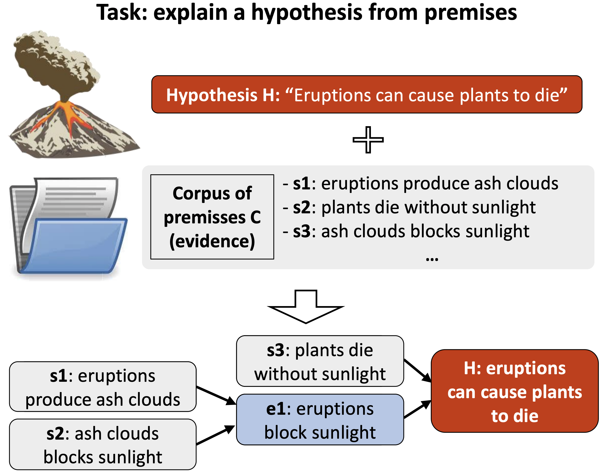
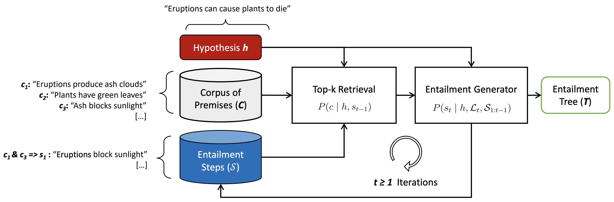

# Iterative Retrieval-Generation Reasoner (NAACL 2022)

This repository contains the code and data for the paper:

[Entailment Tree Explanations via Iterative Retrieval-Generation Reasoner](https://assets.amazon.science/6e/5d/b055e2644da985a210e15b825422/entailment-tree-explanations-via-iterative-retrieval-generation-reasoner.pdf)

**Entailment Trees** represents a chain of reasoning that shows how a hypothesis (or an answer to a question) can be explained from simpler textual evidence. 

<p align="center">

</p>

**Iterative Retrieval-Generation Reasoner** our proposed architecture that iteratively searches for suitable premises, constructing a single entailment step at a time. At every generation step, the model searches for a distinct set of premises that will support the generation of a single step, therefore mitigating the language model’s input size limit and improving generation correctness.

<p align="center">

</p>    

## Setting Up Environemnt

First you need to install the dependencies of the project:

```bash
conda env create --file irgr.yml
pip install -r requirements.txt
```

Then activate your conda environment:

```bash
conda activate irgr
```

### Setting up Jupyter

Most of the code is wrapped inside Jupyter Notebooks.

You can either start a Jupyter server locally or follow the AWS instructions on how to setup the jupyter notebook on EC2 instances and access it through your browser:

https://docs.aws.amazon.com/dlami/latest/devguide/setup-jupyter.html

### Data Folder Structure
   
You can download the [Entailment Bank](https://allenai.org/data/entailmentbank) data and evaluation code by running:

```
python setup.py
```

### Running Experiments

You can re-start the kernel and run the whole notebook to execute data-loading / training / evaluation

dada loading has to be done before executing training and evaluation.

#### Entailment Tree Generation

The main model's code is in `src/entailment_iterative.ipynb`.

The model can generate explanations and proofs for EntailmentBank dataset.

#### Premise Retrieval

The main model's code is in `src/entailment_retrieval.ipynb`.

This model retrieves a set of premises from the corpus. Training uses the EntailmentBank + World Tree V2 corpus.

## Citation

```
@inproceedings{ribeiro-etal-2022-irgr,
    title = "Entailment Tree Explanations via Iterative Retrieval-Generation Reasoner",
    author = "Ribeiro, Danilo N.  and
      Wang, Shen  and
      Ma, Xiaofei  and
      Dong, Rui  and
      Wei, Xiaokai  and
      Zhu, Henry  and
      Chen, Xinchi  and
      Huang, Zhiheng  and
      Xu, Peng  and
      Arnold, Andrew  and
      Roth, Dan",
      booktitle = "Findings of the 2022 Conference of the North American Chapter of the Association for Computational Linguistics: Human Language Technologies",
      year={2022}
}
```